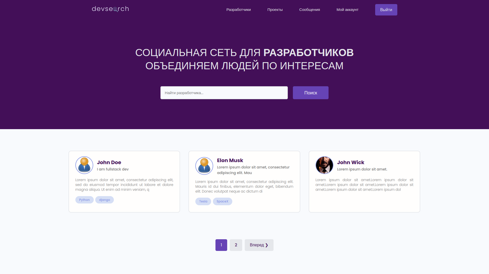
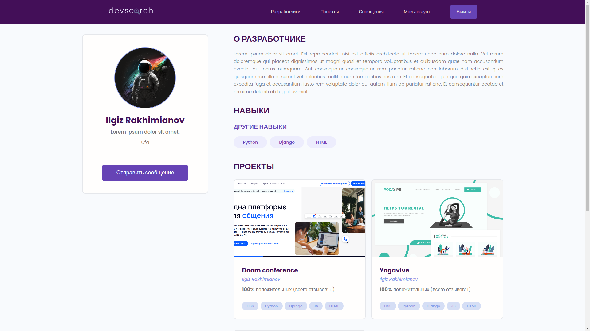

# Django find developers social network


## Requirements

* Python 3.7+
* Django 3.2.x
* Pillow 9.4.x

## Install this application
```
python3 -m venv venv
pip install -r requirements.txt
```  
or  
```
poetry install
```

## Run migrations
```
cd devsearch
python manage.py makemigrations
python manage.py migrate
```

## Screenshots

### Home page


### Projects page


### Profile page


### Login page


### Registration page

